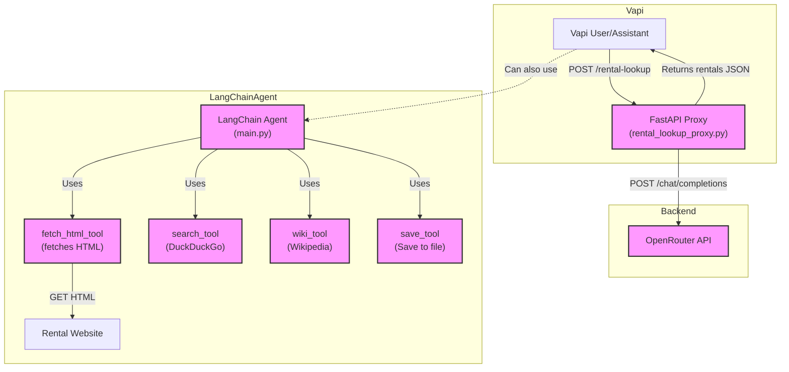

# Vapi Rental Lookup Tool — Full Project Overview & Technical Reference

> This README contains the complete project documentation, architecture, setup, technical flow, and visual proof of success. All information from `DEV_MAN/whatsWorking.md` is included here for easy access on GitHub.

---

# What's Working: Vapi Rental Lookup Tool & LangChain Agent

## Project Overview & Goals

This project enables automated extraction of rental property data from public rental websites, using a combination of:

- A FastAPI proxy for secure, API-driven access to OpenRouter's web-grounded LLMs.
- A LangChain agent with multiple tools for research, web search, HTML extraction, and structured output.
- Integration with Vapi for voice/chat assistant workflows.

**Primary use cases:**

- Letting a Vapi assistant answer questions about available rentals on a given website.
- Providing structured JSON output of rental listings for downstream automation or analysis.
- Enabling both LLM-powered and direct HTML extraction approaches.

---

## Python Files and Their Roles

- **main.py**

  - Entry point for the LangChain agent.
  - Loads environment variables and API keys from `.env`.
  - Sets up the OpenRouter LLM via LangChain's `ChatOpenAI` (model: `openai/gpt-4.1:online`).
  - Defines a Pydantic model (`ResearchResponse`) for structured output.
  - Configures a system prompt instructing the agent to extract rental listings as JSON from website HTML.
  - Imports and registers all tools (search, wiki, save, fetch_html) for the agent.
  - Runs an interactive CLI for research queries, invoking the agent and parsing/printing structured results.

- **tools.py**

  - Defines all tools available to the agent:
    - `search_tool`: Uses DuckDuckGo for general web search.
    - `wiki_tool`: Uses Wikipedia API for factual lookups.
    - `save_tool`: Saves structured research data to a text file with timestamp.
    - `fetch_html_tool`: Fetches raw HTML from a URL using RequestsGetTool (with security enabled), for direct HTML analysis/extraction.
  - Each tool is a LangChain `Tool` object with a name, function, and description.

- **rental_lookup_proxy.py**

  - FastAPI server exposing the `/rental-lookup` endpoint.
  - Accepts POST requests with `{ "website": "<url>" }`.
  - Forwards the request to OpenRouter's chat completions API, enabling the web plugin for real-time web search and extraction.
  - Handles CORS, error logging, and environment variable loading.
  - Returns structured rental data or a summary as JSON.

- **.env**

  - Stores API keys and configuration (e.g., `OPENROUTER_API_KEY`).

- **requirements.txt**
  - Lists all Python dependencies for uv/venv management.

---

## Step-by-Step Request Flow

1. **User (via Vapi or CLI) submits a rental lookup query** (e.g., "How many rentals are available on <website>?").
2. **Vapi (or user) sends a POST request to `/rental-lookup`** on the FastAPI proxy, with the website URL in the payload.
3. **FastAPI proxy**:
   - Loads the OpenRouter API key from `.env`.
   - Constructs a request to OpenRouter's `/chat/completions` endpoint, enabling the web plugin and passing a prompt to extract rental listings from the target website.
   - Handles errors and logs raw responses for debugging.
   - Returns the extracted rental data (or a summary) as JSON.
4. **LangChain agent (main.py)** (optional, for research/automation):
   - User can run the agent interactively.
   - The agent uses the OpenRouter LLM and available tools to fetch HTML, search, or look up information as needed.
   - The agent's system prompt instructs it to extract rental listings as JSON.
   - Output is parsed and printed as a structured Pydantic object.

---

## Tools: Detailed Descriptions

- **search_tool**: Uses DuckDuckGo to perform general web searches for information related to the query.
- **wiki_tool**: Queries Wikipedia for factual information, useful for background or context.
- **save_tool**: Saves the agent's structured output to a timestamped text file for record-keeping or further analysis.
- **fetch_html_tool**: Fetches the raw HTML content of a web page. Essential for extracting structured data (like rental listings) directly from the website's source.

---

## Mermaid Diagram: System Architecture & Flow



---

## Environment Setup & Running

- **Install dependencies:**

  ```sh
  uv add -r requirements.txt
  uv add langchain_community langchain_openai fastapi uvicorn httpx python-dotenv wikipedia
  ```

- **Run FastAPI proxy:**
  ```sh
  uv run -m uvicorn rental_lookup_proxy:app --host 0.0.0.0 --port 4242 --reload
  ```
- **Run LangChain agent:**
  ```sh
  uv run main.py
  ```
- **Test endpoint:**
  ```sh
  curl -X POST http://localhost:4242/rental-lookup \
    -H "Content-Type: application/json" \
    -d '{"website": "https://nolenpropertiesllc.managebuilding.com/Resident/public/home"}'
  ```

---

## What’s Working

- FastAPI proxy is running and accessible via ngrok for Vapi integration.
- LangChain agent can use OpenRouter and all tools, including HTML fetching.
- Tools are modular and can be extended or swapped as needed.
- System prompt and output parsing are tailored for structured rental data extraction.
- End-to-end flow from Vapi/CLI → FastAPI → OpenRouter → rental data is functional.

---

## Visual Proof of Success

Below are screenshots demonstrating the successful end-to-end integration:


---

## Updated End-to-End App Flow (API Tool + Agent Conversation)

- The Vapi agent is now configured to use the API tool, which POSTs directly to the FastAPI backend.
- When a user asks the agent about available rentals, the agent:
  1. Recognizes the intent and triggers the API tool.
  2. The API tool sends a POST request to the FastAPI `/rental-lookup` endpoint with the website URL in the JSON body.
  3. The FastAPI backend invokes the LangChain agent, which uses OpenRouter's web-enabled LLM and its tools (including HTML fetching) to extract rental data from the internet.
  4. The backend returns structured rental data as JSON to the API tool.
  5. The Vapi agent receives the data and relays it back to the user in the conversation.
- This enables real-time, conversational access to live rental listings from the web, powered by LLMs and custom extraction logic.

---

## Conversational Example

- **User:** "What rentals are available on Nolen Properties?"
- **Vapi Agent:** (calls API tool)
- **API Tool:** (POSTs to FastAPI backend)
- **FastAPI Backend:** (runs LangChain agent, fetches/extracts data)
- **Vapi Agent:** "Here are the available rentals: ..." (lists properties)

---

## Technical Integration Recap

- **API Tool**: Ensures reliable parameter passing and dashboard testing.
- **FastAPI Backend**: Handles POST requests, invokes LangChain agent, and returns structured data.
- **LangChain Agent**: Uses OpenRouter LLM and tools to extract and format rental data from the web.
- **Vapi Agent**: Orchestrates the conversation, calls the tool, and presents results to the user.

---

## Next Steps

- [ ] Continue refining extraction logic and prompts for even better results.
- [ ] Expand to support more rental websites or data types.
- [ ] Add more visual documentation and user stories as the system evolves.
