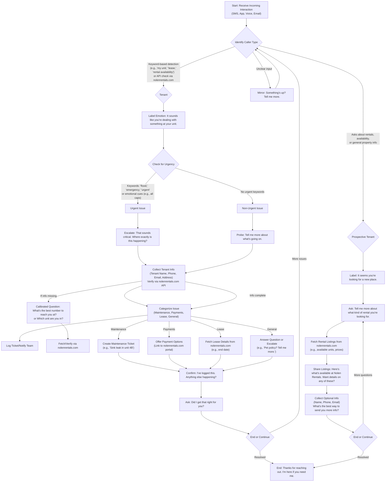

```mermaid
graph TD
    A["Start: Receive Incoming Interaction\n(SMS, App, Voice, Email)"] --> B{Identify Caller Type}

    B -->|"Keyword-based detection\n(e.g., 'my unit,' 'lease,' 'rental availability')\nor API check via nolenrentals.com"| C{Tenant}
    B -->|"Asks about rentals, availability,\nor general property info"| D{Prospective Tenant}
    B -->|"Unclear input"| AD["Mirror: Something's up? Tell me more."] --> B

    %% Tenant Branch
    C --> E["Label Emotion: It sounds like you're dealing with something at your unit."] --> F{Check for Urgency}
    F -->|"Keywords: 'flood,' 'emergency,' 'urgent'\nor emotional cues (e.g., all caps)"| G["Urgent Issue"]
    F -->|"No urgent keywords"| H["Non-Urgent Issue"]

    G --> I["Escalate: That sounds critical. Where exactly is this happening?"] --> J["Collect Tenant Info\n(Tenant Name, Phone, Email, Address)\nVerify via nolenrentals.com API"] --> K["Categorize Issue\n(Maintenance, Payments, Lease, General)"] --> L["Log Ticket/Notify Team"]
    H --> M["Probe: Tell me more about what's going on."] --> J

    J -->|"If info missing"| N["Calibrated Question: What's the best number to reach you at?\nor Which unit are you in?"] --> O["Fetch/Verify via nolenrentals.com"]
    J -->|"Info complete"| K

    K -->|"Maintenance"| P["Create Maintenance Ticket\n(e.g., 'Sink leak in unit 4B')"] --> Q["Confirm: I've logged this. Anything else happening?"]
    K -->|"Payments"| R["Offer Payment Options\n(Link to nolenrentals.com portal)"] --> Q
    K -->|"Lease"| S["Fetch Lease Details from nolenrentals.com\n(e.g., end date)"] --> Q
    K -->|"General"| T["Answer Question or Escalate\n(e.g., 'Pet policy? Tell me more.')"] --> Q

    Q --> U["Ask: Did I get that right for you?"] --> V{End or Continue}
    V -->|"More issues"| B
    V -->|"Resolved"| W["End: Thanks for reaching out. I'm here if you need me."]

    %% Prospective Tenant Branch
    D --> X["Label: It seems you're looking for a new place."] --> Y["Ask: Tell me more about what kind of rental you're looking for."] --> Z["Fetch Rental Listings from nolenrentals.com\n(e.g., available units, prices)"] --> AA["Share Listings: Here’s what’s available at Nolen Rentals. Want details on any of these?"] --> AB["Collect Optional Info\n(Name, Phone, Email)\nWhat's the best way to send you more info?"] --> AC{End or Continue}
    AC -->|"More questions"| Y
    AC -->|"Resolved"| W
```
